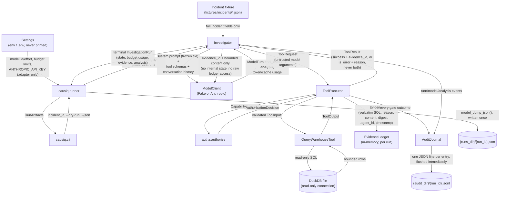

# Data flow (P0.6 / P0.7, as built)

**Status:** describes the code as it exists at the end of P0.7 - what actually
crosses each boundary today, not a target design. See `execution-flow.md` for
the corresponding control-flow sequence.

## Boundary diagram

## What crosses each boundary, explicitly

| Boundary | What crosses it | What does **not** cross it |
|---|---|---|
| Incident fixture → `Investigator` | Every `Incident` field, rendered as plain text (`_render_incident_brief`) | No other incidents, no ledger contents, no application internals |
| `Settings` → adapter | Model id/effort/max-tokens, `ANTHROPIC_API_KEY` (read once, held as `SecretStr`, never logged or printed) | The key is never placed in history, a prompt, a log line, or the persisted `InvestigationRun` |
| `Investigator` → `ModelClient` | The frozen system prompt, `ToolRegistry.schemas()` (name-sorted JSON), and the full `ConversationMessage` history built so far | No Python objects, no ledger, no registry internals - only what earlier turns explicitly put into a `TextBlock`/`ToolResultBlock` |
| `ModelClient` → `Investigator` | A `ModelTurn`: either tool calls or a schema-valid `Analysis`, plus token/cache usage | No raw SDK types (Anthropic types are translated inside the adapter and never escape it) |
| `Investigator` → `ToolExecutor` | A `ToolRequest` built directly from the model's (untrusted) arguments | Nothing is authorized or filtered before this point - authorization happens *inside* the executor, never before |
| `ToolExecutor` → `EvidenceLedger` | `Evidence`: verbatim SQL, the stated reason, the tool's output content, a content digest, the acting agent id, a timestamp | Nothing on a denied, invalid, failed, or timed-out call - only a successful execution produces evidence (invariant I1) |
| `ToolExecutor` → `Investigator`/model | A `ToolResult` rendered as `evidence_id` + bounded content on success, or an `is_error` message on failure | No stack traces, no internal exception detail, no unrelated ledger entries |
| `Investigator`/`ToolExecutor` → `AuditJournal` | One entry per gate crossed (run started, each model call, each authorization decision, each tool outcome, citation validation, run ended) | No secrets; audit `detail` fields are plain JSON built from already-public request/response data |
| `AuditJournal` → disk | One JSON object per line, flushed after every write (`JsonlAuditSink`) | Nothing buffered - a crash mid-run leaves a valid, readable prefix |
| `Investigator` → `causiq.runner` | The full terminal `InvestigationRun` - state, budget usage, every evidence record collected, the analysis if any, the failure reason if any | Nothing beyond what `InvestigationRun` already models; the runner does not separately query the ledger |
| `causiq.runner` → disk | `InvestigationRun.model_dump_json()`, written once after the run ends, regardless of terminal state | Nothing incremental - see the persistence boundary/limitation documented in `causiq.runner`'s module docstring |
| `causiq.runner` → `causiq.cli` | `RunArtifacts` (the run plus the two file paths) | Nothing else - the CLI never touches DuckDB, the ledger, or a tool directly |
