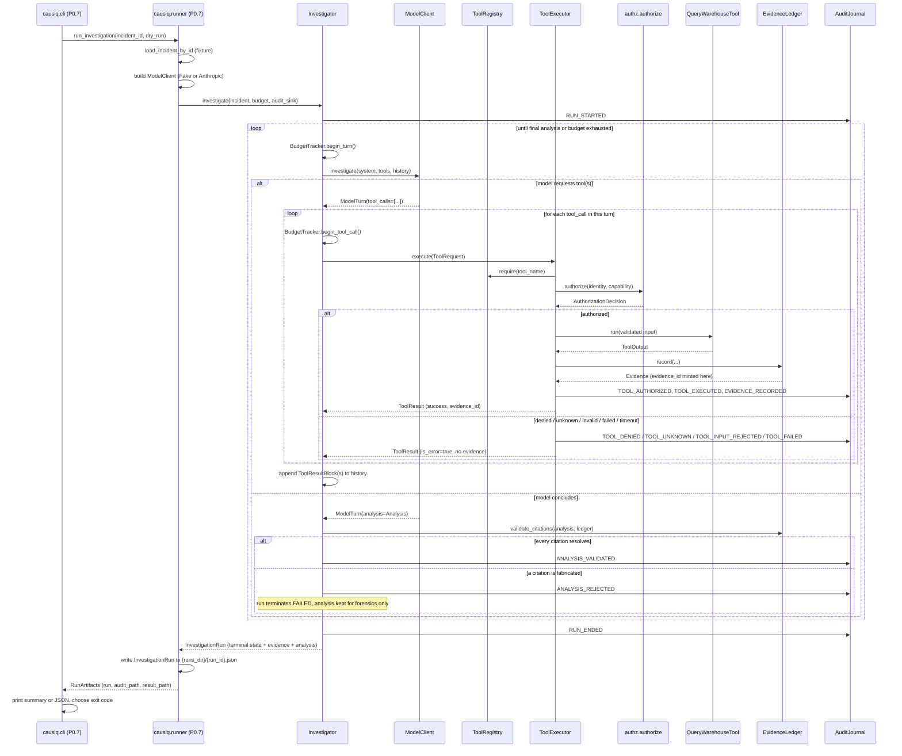

# Execution flow (P0.6 / P0.7, as built)

**Status:** describes the code as it exists at the end of P0.7. This is not a
target architecture diagram - see `docs/PHASE_0_PLAN.md` §5 for what is
explicitly deferred, and the note at the bottom of this file for how later
phases are expected to extend it.

## One investigation, start to finish

## What each box actually is

| Box | Module | Notes |
|---|---|---|
| `causiq.cli` | `src/causiq/cli.py` | Argument parsing, output formatting, exit code. No investigation logic. |
| `causiq.runner` | `src/causiq/runner.py` | Chooses the `ModelClient`, assembles the registry/identity, calls `Investigator`, persists the result. |
| `Investigator` | `src/causiq/agents/investigator.py` | Owns the bounded loop. The only caller of `ModelClient`, `ToolExecutor`, and `validate_citations`. |
| `ModelClient` | `src/causiq/llm/ports.py` (+ `fake_client.py`, `anthropic_client.py`) | Provider-neutral port; exactly one adapter imports the `anthropic` SDK. |
| `ToolRegistry` / `ToolExecutor` | `src/causiq/tools/` | The single path from a model's intent to a real system call (invariant I3). |
| `authz.authorize` | `src/causiq/authz/decision.py` | The only place an authorization decision is made. |
| `QueryWarehouseTool` | `src/causiq/tools/warehouse.py` | The one registered tool: read-only DuckDB access. |
| `EvidenceLedger` | `src/causiq/evidence/ledger.py` | The only code path that can mint evidence - `Tool.run()` itself has no ledger parameter. |
| `AuditJournal` | `src/causiq/audit/journal.py` | Append-only, sequenced, flushed on every write. |

## What is deliberately not in this diagram

Per `docs/PHASE_0_PLAN.md` §5, none of the following exist yet, and this
diagram does not pretend they do: a second tool, a second incident, an
orchestrator or any multi-agent structure, MCP, OpenTelemetry/Langfuse
exporters (the `Tracer` port and span names exist from P0.4, but nothing
exports them), an evaluation harness, remediation execution, or any
deployment target. Each is deferred to a named later phase.
